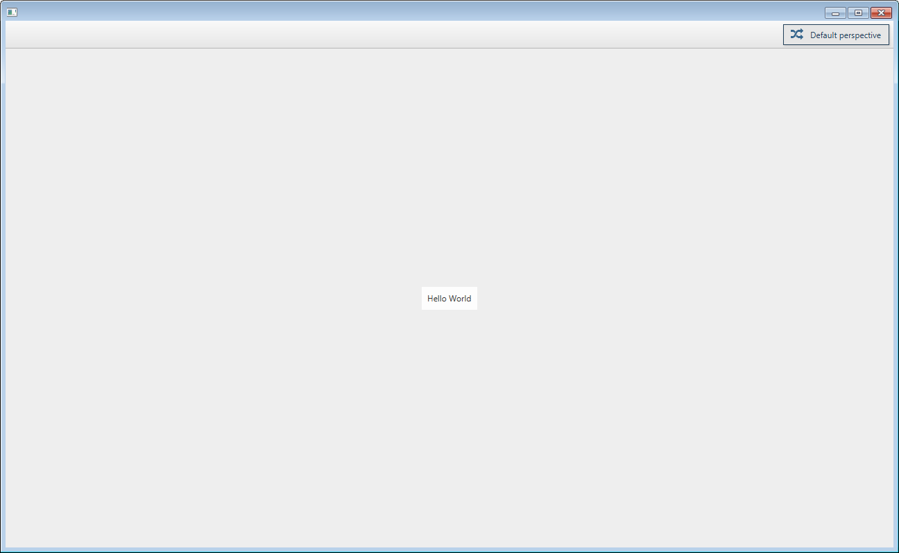

[](https://app.codacy.com/app/minifx-developers/minifx-workbench?utm_source=github.com&utm_medium=referral&utm_content=minifx/minifx-workbench&utm_campaign=Badge_Grade_Dashboard)
[](https://github.com/minifx/minifx-workbench/releases/)
[](https://travis-ci.com/minifx/minifx-workbench)
[](https://opensource.org/licenses/Apache-2.0) 
[](https://codecov.io/gh/minifx/minifx-workbench)


# MiniFx Workbench

We believe that organizing java applications inside a dependency-injection container (like spring) is (almost) always beneficial. 
Even when writing GUIs. Doing so makes such applications very modular. Further, we wanted to organize our applications 
in a workbench manner (e.g. like eclipse does), but without a big overhead of osgi or similar. Based on these two premises, minifx-workbench was born: 
It is based on spring and additional custom annotations.

## Gradle

To add a dependency on minifx-workbench in gradle, add the following to your ```build.gradle``` file:

```gradle
dependencies {
    compile "org.minifx:minifx-workbench:x.x.x"
}
```

```x.x.x``` corresponds to the latest version, which can be found at the top of this page.

## Maven

To add a dependency on minifx-workbench in maven, add the following to your ```pom.xml``` file:

```xml
<dependency>
    <groupId>org.minifx</groupId>
    <artifactId>minifx-workbench</artifactId>
    <version>x.x.x</version>
</dependency>
```

```x.x.x``` corresponds to the latest version, which can be found at the top of this page.


## The Workbench
When organizing our javafx applications in a workbench-like manner within minifx, then we have to understand two 
main concepts:
* __perspectives:__ If you are familiar with e.g. eclipse,  then you know intuitively what we mean by this: 
In short, perspectives are kind of pages within a GUI, in which several views can be arranged. All views in 
one perspective are visible at the same time. Perspectives can be switched by buttons in a toolbar at the right 
top corner of the application.
* __views__: A view can be any javafx node which can be placed within a perspective. Per default each perspective 
is organized like a border layout, so each view can be placed either left, right, top, bottom or center within
the perspective.

### The most simplistic example
Lets assume, we have a spring configuration class that defines one bean:
```java
@Configuration
public class SimplisticConfiguration {
    
    @View
    @Bean
    public Label helloWorldLabel() {
        return new Label("Hello World");
    } 
    
}
```
Note the custom annotation ```@View``` on the factory method of the bean: It tells minifx to place this bean as a 
view within the application. This can be further customized, as we will see later. 

A simple application can then be run by the following main method:
```java
public class SimplisticMiniFxApplication {
    public static void main(String... args) {
        MiniFx.launcher(SimplisticConfiguration.class).launch(args);
    }
}
``` 

This would bring up something like this:



### Defining Custom Perspectives
As seen in the simplistic example, per default MiniFx creates one perspective (the 'Default perspective') in which it 
places all the views for which nothing else is specified. Usually, we want to group our views in different perspectives.
The minimal thing to define a new perspective, is to create an interface (or a class) that inherits from 
[```Perspective```](src/main/java/org/minifx/workbench/domain/Perspective.java).


### MiniFx Configuration
MiniFx is configured through custom annotations which complement the spring built in annotations for the purpose of layouting GUIs.
As shown in the previous example, it is very easy to bootstrap a javafx application with minifx. MiniFx assumes 
proper defaults so that all the views are displayed in the application. However, usually we want to define ourselves 
where our view shall be placed.


## Launching General JavaFx applications from spring contexts

In the background, MiniFx uses a proprietary launcher to construct javafx applications from spring context. 
This launcher can be also used to launch general javafx applications from spring contexts, even if the features 
of the workbench are not intended to be used. 

Assuming, we would have a spring configuration class ```MyConfiguration```, which provides _exactly one(!)_ scene 
in its resulting application context, then we can launch a new javafx application like this: 

```java
public class MyJavaFxApplication {
    public static void main(String... args) {
        SingleSceneSpringJavaFxApplication.launcher().configurationClasses(MyConfiguration.class).launch(args);
    }
}
``` 

Note that in this case, ```MyJavaFxApplication``` does not inherit from ```javafx.application.Application```.

The reason for this proprietary launcher is that at a first glance, 
it is not trivial to bootstrap a javafx application from a spring context: 
All the javafx components have to be created within the javafx thread. This is usually accomplished
by inheriting from ```javafx.application.Application``` and overriding the ```start(Stage primaryStage)``` 
method. However, when using spring we want already our primary stage to be configured (e.g. autowired) 
by spring...

#### Optional Launcher Parameters
To Further customize the resulting application, the javafx launcher has some more options. For example: 
```java
public class MyJavaFxApplication {
    public static void main(String... args) {
        SingleSceneSpringJavaFxApplication.launcher()
            .configurationClasses(MyConfiguration.class)
            .windowTitle("First JavaFx Application")
            .windowCloseHandler(evt -> System.exit(0))
            .launch(args);
    }
}
``` 
This provides a custom window title and an handler for the event of closing the window.