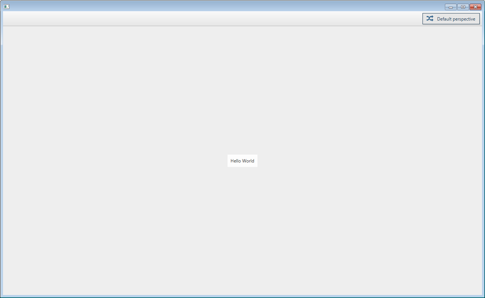
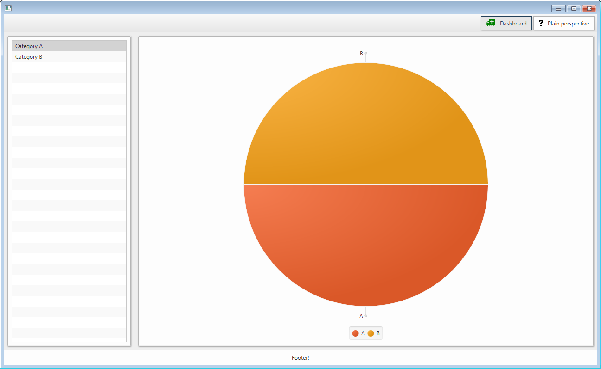

[](https://app.codacy.com/app/minifx-developers/minifx-workbench?utm_source=github.com&utm_medium=referral&utm_content=minifx/minifx-workbench&utm_campaign=Badge_Grade_Dashboard)
[](https://github.com/minifx/minifx-workbench/releases/)
[](https://travis-ci.com/minifx/minifx-workbench)
[](https://opensource.org/licenses/Apache-2.0) 
[](https://codecov.io/gh/minifx/minifx-workbench)

This package is maintained as part of the [minifx](https://github.com/minifx) organization on github. The main web page 
of minifx can be found [here](https://minifx.org).

## Motivation

We believe that organizing java applications inside a dependency-injection container (like spring) is (almost) always beneficial. 
Even when writing GUIs. Doing so makes such applications very modular. Further, we wanted to organize our applications 
in a workbench manner (e.g. like eclipse does), but without a big overhead of osgi or similar. Based on these two premises, minifx-workbench was born: 
It is based on spring and additional custom annotations.

## Getting Started

Depending on your build system, one of the following configuration options applies:

### Gradle

To add a dependency on minifx-workbench in gradle, add the following to your ```build.gradle``` file:

```gradle
dependencies {
    compile "org.minifx:minifx-workbench:x.x.x"
}
``` 

```x.x.x``` corresponds to the latest version, which can be found at the top of this page.

### Maven

To add a dependency on minifx-workbench in maven, add the following to your ```pom.xml``` file:

```xml
<dependency>
    <groupId>org.minifx</groupId>
    <artifactId>minifx-workbench</artifactId>
    <version>x.x.x</version>
</dependency>
```

```x.x.x``` corresponds to the latest version, which can be found at the top of this page.

## The Workbench
When organizing our javafx applications in a workbench-like manner within minifx, then we have to understand two 
main concepts:
* __perspectives:__ If you are familiar with e.g. eclipse,  then you know intuitively what we mean by this: 
In short, perspectives are kind of pages within a GUI, in which several views can be arranged. All views in 
one perspective are visible at the same time. Perspectives can be switched by buttons in a toolbar at the right 
top corner of the application.
* __views__: A view can be any javafx node which can be placed within a perspective. Per default each perspective 
is organized like a border layout, so each view can be placed either left, right, top, bottom or center within
the perspective.

### The most simplistic example
Lets assume, we have a spring configuration class that defines one bean:
```java
@Configuration
public class SimplisticConfiguration {
    
    @View
    @Bean
    public Label helloWorldLabel() {
        return new Label("Hello World");
    } 
    
}
```
Note the custom annotation ```@View``` on the factory method of the bean: It tells minifx to place this bean as a 
view within the application. This can be further customized, as we will see later. 

A simple application can then be run by the following main method:
```java
public class SimplisticMiniFxApplication {
    public static void main(String... args) {
        MiniFx.launcher(SimplisticConfiguration.class).launch(args);
    }
}
``` 

This would bring up something like this:



### Defining Custom Perspectives
As seen in the simplistic example, per default MiniFx creates one perspective (the 'Default perspective') in which it 
places all the views for which nothing else is specified. Usually, we want to group our views in different perspectives.
The minimal thing to define a new perspective, is to create an interface (or a class) that inherits from 
[```Perspective```](https://github.com/minifx/minifx-workbench/blob/master/src/java/org/minifx/workbench/domain/Perspective.java).

For example, we could create a new perspective like:
```java
public interface DebugPerspective extends Perspective {}
```

This then could be used in a configuration like:
```java
@Configuration
public class ConfigurationWithCustomPerspective {
    
    @View(in = DebugPerspective.class, at = CENTER)
    @Bean
    public Label helloWorldLabel() {
        return new Label("Hello World");
    } 
    
}
```
In this example, the ```@View``` applied to the bean specifies that the bean shall be put at the center of the debug perspective. 

### MiniFx Configuration by Annotations
MiniFx is configured through custom annotations which complement the spring built in annotations for the purpose of layouting GUIs.
As shown in the previous examples, it is very easy to bootstrap a javafx application with minifx. MiniFx assumes 
proper defaults so that all the views are displayed in the application. However, usually we want to have a bit more 
fine-grained control how our components are layed out. This can be achieve with a combination of annotations, partially 
particular to minifx, partially spring built-in annotations.

Some general remarks:
* All of the annotations described in the following can be placed on both factory methods and types (e.g. on classes 
annotated with the spring ```@Component``` or ```@Service``` annotation). Most of them can be used on both, views and 
perspectives (where they always will be placed on the type, as perspectives are types). 
* The MiniFx custom annotations do __NOT REPLACE__ the spring annotations like ```@Bean``` or ```@Component```. As long 
as a view is not detected as a bean in the spring context, the minifx annotations have no effect and the views will be 
not be shown in the application.
* For the moment, we assume that all the beans which shall become views in MiniFx have to be javafx nodes already. 
However, as we will see later, there are extensions (built-in or custom ```NodeCreator```s) which lift this constraints. 

When layouting the final application, MiniFx follows the following procedure:
1. It collects all the beans which are annotated by a ```@View``` annotation, either on their type or their factory method.
2. It extracts the display information from the annotations converts the beans to javafx nodes (See NodeCreators for more details)
3. It collects all used perspectives from the views. Perspectives in which no nodes are shown, will not be visible in the final layout.
4. It creates a pane for each used perspective and places the views accordingly (left, right, bottom, top, center). 
If more then one view shall be placed into the same position in the same perspective, then automatically a tab pane is 
created at this position.

The following table lists the annotations to be used for configuring components within MiniFx:

| Annotation | Can be used on | Description | Default Value (if not specified)
|----------|-----------|------------|--------|
|[```@View```](https://minifx.org/minifx-workbench/javadoc/org/minifx/workbench/annotations/View.html)| View | Specifies in which perspective and at what position the node represented by the given bean shall be placed.| CENTER in the default perspective|
|[```@Name```](https://minifx.org/minifx-workbench/javadoc/org/minifx/workbench/annotations/Name.html)| View, Perspective, Footer | Specifies the name which shall be used for displaying the view/perspective | The name of the bean if constructed by a factory method, otherwise the class name of the view/perspective. |
|[```@Icon```](https://minifx.org/minifx-workbench/javadoc/org/minifx/workbench/annotations/Icon.html)| View, Perspective, Footer | Specifies the icon and its color for a view/perspective | a default icon in black |
|[```@Order```](https://docs.spring.io/spring-framework/docs/current/javadoc-api/org/springframework/core/annotation/Order.html)|View, Perspective, Footer | Per default, minifx guarantees no order when it inserts Views and Footers. However, if an integer value for the order is provided through this spring-internal annotation, then this is taken into account when placing perspectives, views at the same position and footers. | No order guaranteed. |
|[```@Footer```](https://minifx.org/minifx-workbench/javadoc/org/minifx/workbench/annotations/Icon.html)|Footer | Specifies that the given bean shall be laid out as a footer in the workbench. This is basically a view outside of all perspectives, placed at the lower part of the GUI and thus always visible. | If no footer specified, the footer region is suppressed. |
|[```@ToolbarItem```](https://minifx.org/minifx-workbench/javadoc/org/minifx/workbench/annotations/ToolbarItem.html)|ToolbarItem | Specifies that the given bean shall be placed in the toolbar. This item is NOT converted and thus has to be a javafx Node! No order is guaranteed! | |


### Supported Views
As already briefly mentioned above, different type of beans are supported out of the box to be placed as views inside 
minifx workbench. The following table lists, what view will be created if a ```@View``` annotation is place on 
different type of beans:

| Bean Type | Resulting View |
|-----------|----------------|
| JavaFx Node | This is the most common and most basic use case. The node itself is put as view into the GUI. |
| Swing Component | Will be wrapped into a javfx SwingNode. |
| URL or String starting with 'http://' or 'https://'| Will be converted into a WebView which displays the given URL.|

## Some more examples

* An example, demonstrating some more of the minifx features, can be found in the test package under
[org/minifx/workbench/examples/simpledemo](https://github.com/minifx/minifx-workbench/blob/master/src/test/java/org/minifx/workbench/examples/simpledemo).
When running the [corresponding main class](https://github.com/minifx/minifx-workbench/blob/master/src/test/java/org/minifx/workbench/examples/simpledemo/DemoMain.java), 
it looks somehow like this:


* Another example, with even more views, can be found in the test package under
[org/minifx/workbench/conf/fullyconfigured](https://github.com/minifx/minifx-workbench/blob/master/src/test/java/org/minifx/workbench/conf/fullyconfigured).
The corresponding screenshot is not so beautiful, but still can be found here: [docs/images/FullyConfiguredExample.PNG](images/FullyConfiguredExample.PNG)

## Launching other JavaFx applications from spring contexts

In the background, MiniFx uses a proprietary launcher to construct javafx applications from spring context. 
This launcher can be also used to launch general javafx applications from spring contexts, even if the features 
of the workbench are not intended to be used. 

Assuming, we would have a spring configuration class ```MyConfiguration```, which provides _exactly one(!)_ scene 
in its resulting application context, then we can launch a new javafx application like this: 

```java
public class MyJavaFxApplication {
    public static void main(String... args) {
        SingleSceneSpringJavaFxApplication.launcher().configurationClasses(MyConfiguration.class).launch(args);
    }
}
``` 

Note that in this case, ```MyJavaFxApplication``` does not inherit from ```javafx.application.Application```.

The reason for this proprietary launcher is that at a first glance, 
it is not trivial to bootstrap a javafx application from a spring context: 
All the javafx components have to be created within the javafx thread. This is usually accomplished
by inheriting from ```javafx.application.Application``` and overriding the ```start(Stage primaryStage)``` 
method. However, when using spring we want already our primary stage to be configured (e.g. autowired) 
by spring...

#### Optional Launcher Parameters
To Further customize the resulting application, the javafx launcher has some more options. For example: 
```java
public class MyJavaFxApplication {
    public static void main(String... args) {
        SingleSceneSpringJavaFxApplication.launcher()
            .configurationClasses(MyConfiguration.class)
            .windowTitle("First JavaFx Application")
            .windowCloseHandler(evt -> System.exit(0))
            .launch(args);
    }
}
``` 
This provides a custom window title and an handler for the event of closing the window.

## Build Artifacts of the Latest Version

* [dependency license report](https://minifx.org/minifx-workbench/dependency-license/index.html)
* [junit test report](https://minifx.org/minifx-workbench/tests/test/index.html)
* [jacoco test report](https://minifx.org/minifx-workbench/jacoco/test/html/index.html) 
* [javadoc](https://minifx.org/minifx-workbench/javadoc/index.html) 